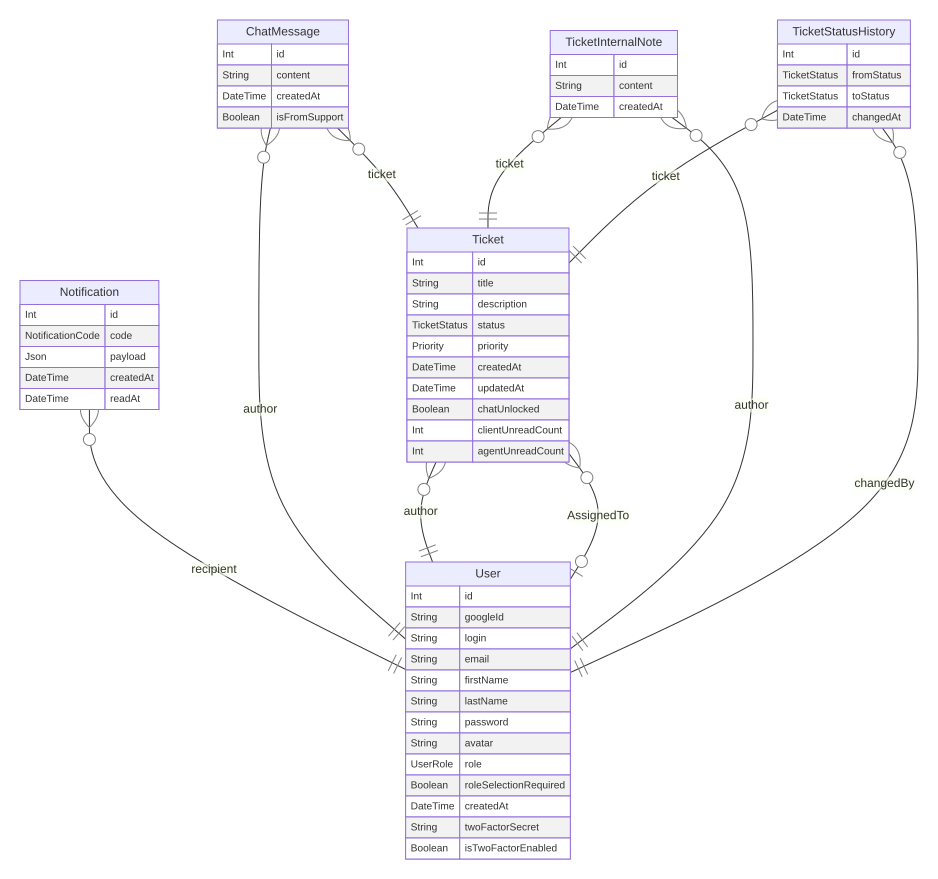

*This project has been created as part of the 42 curriculum by pmihangy, srasolom, irazafim, vmpianim.*

# Tikeo - ft_transcendence

## Table of Contents

- [Description](#description)
- [Instructions](#instructions)
- [Team Information](#team-information)
- [Project Management](#project-management)
- [Technical Stack](#technical-stack)
- [Database Schema](#database-schema)
- [Features List](#features-list)
- [Modules](#modules)
- [Individual Contributions](#individual-contributions)
- [Resources](#resources)
- [Additional Notes](#additional-notes)

## Description

**Project name:** Tikeo

Tikeo is a real-time support ticket platform built for the 42 ft_transcendence project.
Its goal is to make client support fast, traceable, and collaborative by combining a role-based workflow with live updates.

### Goal

- Let clients create and track tickets easily.
- Give agents a structured pipeline to process and resolve requests.
- Give admins full control on users, moderation, and analytics.

### Key Features

- Role-based application with dedicated views: Client, Agent, Admin.
- Secure authentication (JWT + OAuth2 Google).
- Complete ticket lifecycle management (open -> in progress -> resolved -> closed).
- Real-time updates and ticket chat using WebSockets.
- Notification system for creation/update/deletion workflows.
- Advanced search with filters, sorting, and pagination.
- Analytics dashboards with visualizations and exports.
- Internationalization with at least 3 languages.

## Instructions

### Prerequisites

- Linux or macOS shell environment recommended.
- Docker Engine (24+ recommended).
- Docker Compose v2.
- GNU Make.
- OpenSSL (used by the `make certs` target).
- HTTPS port access on `8443` (and optionally `8080`).

### Required Configuration

Create `backend/.env` and define at least:

- `DATABASE_URL`
- `JWT_SECRET`
- `GOOGLE_CLIENT_ID`
- `GOOGLE_CLIENT_SECRET`
- `GOOGLE_REDIRECT_URI`
- `ADMIN_LOGIN`
- `ADMIN_EMAIL`
- `ADMIN_PASSWORD`

Example redirect URI used by Docker config:

- `GOOGLE_REDIRECT_URI=https://localhost:8443/api/auth/google/callback`

### Step-by-Step Run

1. Clone the repository.
2. Move into the project root.
3. Create the environment file: `backend/.env`.
4. Fill all required variables listed above.
5. Start the full stack:
   - `make`
6. Open the app in your browser:
   - `https://localhost:8443`

### Useful Commands

- `make up`: restart existing services.
- `make down`: stop services.
- `make re`: full clean + rebuild.
- `make prisma-studio`: open Prisma Studio.
- `make clear-volume`: remove Docker volumes.

### Local Dev (without Docker, optional)

- Backend:
  - `cd backend && npm install && npm run start:dev`
- Frontend:
  - `cd frontend && npm install && npm run dev`

## Team Information

| Member | Login | Assigned Role(s) | Main Responsibilities |
| --- | --- | --- | --- |
| Mihangy | pmihangy | Product Owner (PO), Developer | Product vision, feature prioritization, search and analytics filtering tasks, UX consistency review |
| Sahaza | srasolom | Product Manager (PM), Scrum Master, Developer | Sprint organization, planning/follow-up, API and notification-related implementation, delivery coordination |
| Iriana | irazafim | Technical Lead, Architect, Developer | Global architecture, backend design choices, real-time pipeline and technical coherence across services |
| Finaritra | vmpianim | Developer | Feature implementation support, UI integration support, testing and stabilization support |

## Project Management

### Team Organization

- Work was split by functional scope (auth, ticketing, realtime, analytics, i18n, admin).
- Members shared ownership on core flows to reduce single points of failure.
- Regular sync points were used to unblock integration and keep priorities aligned.

### Tools Used

- GitHub repository for source control and review flow.
- GitHub Issues/board-style tracking for backlog and progress visibility.
- Conventional commits for clearer project history (`feat`, `fix`, `docs`, etc.).

### Communication Channels

- Discord for daily technical communication and quick decisions.
- In-repo discussions and pull-request comments for traceable technical decisions.

## Technical Stack

### Frontend

- React 19 + TypeScript
- Vite (rolldown-vite)
- Tailwind CSS + DaisyUI
- React Router
- i18next / react-i18next
- Socket.IO client
- Recharts + jsPDF

### Backend

- NestJS 11 + TypeScript
- Prisma ORM
- JWT authentication
- Google OAuth2
- Socket.IO gateway (WebSocket)
- Throttling/rate limiting

### Database

- PostgreSQL 15

### Other Significant Technologies

- Docker + Docker Compose for reproducible local environment.
- Nginx as reverse proxy and HTTPS gateway.

### Justification of Major Technical Choices

- **React + NestJS:** type-safe full-stack with strong ecosystem and maintainability.
- **Prisma + PostgreSQL:** reliable relational modeling for users/tickets/messages and clear migrations.
- **WebSockets (Socket.IO):** required for real-time support workflows and live notifications.
- **Dockerized architecture:** fast onboarding and consistent runtime for all team members.

## Database Schema

### Visual Representation

### Tables and Relationships

- `User` is the central identity table (roles: CLIENT, AGENT, ADMIN).
- `Ticket` belongs to one author (`authorId`) and can be assigned to one agent (`AssignedToId`).
- `ChatMessage` belongs to one ticket and one author.
- `TicketInternalNote` belongs to one ticket and one author.
- `TicketStatusHistory` tracks each status transition with actor and timestamps.
- `Notification` belongs to one recipient user.

### Key Fields and Data Types

- `User.id` (Int), `email` (String unique), `role` (enum `UserRole`), `googleId` (String unique nullable).
- `Ticket.id` (Int), `title` (String), `description` (String), `status` (enum `TicketStatus`), `priority` (enum `Priority`), unread counters (Int).
- `ChatMessage.content` (String), `createdAt` (DateTime), `isFromSupport` (Boolean).
- `Notification.code` (enum `NotificationCode`), `payload` (Json), `readAt` (DateTime nullable).

## Features List

| Feature | Description | Team Member(s) |
| --- | --- | --- |
| Role-based interfaces | Different views/actions for Client, Agent, Admin | irazafim, srasolom, pmihangy, vmpianim |
| Ticket lifecycle workflow | Full lifecycle from creation to closure with status history | irazafim, srasolom, vmpianim |
| Real-time ticket updates | Live update propagation with Socket.IO | irazafim, srasolom |
| Ticket chat | Real-time conversation in ticket context | irazafim, vmpianim |
| OAuth2 login | Remote authentication with Google | irazafim, srasolom |
| JWT security + permissions | Guards, role checks, controlled API access | irazafim, srasolom |
| Notification system | Notifications for create/update/delete actions | srasolom |
| Advanced search | Filter/sort/paginate for better ticket navigation | pmihangy |
| Admin user management | User CRUD and role governance | srasolom, irazafim |
| Analytics dashboard | Visual metrics and role-appropriate insights | pmihangy, srasolom |
| Data export | PDF/CSV export from analytics views | srasolom |
| i18n (3 languages+) | Multi-language interface and translations | pmihangy, vmpianim |
| Browser support efforts | Compatibility work on multiple browsers | vmpianim, pmihangy |

## Modules

### Selected Modules and Points

| Category | Module | Type | Points | Why Chosen | Implementation Summary | Team Member(s) |
| --- | --- | --- | ---: | --- | --- | --- |
| Web | Framework for frontend + backend | Major | 2 | Improves maintainability and team velocity | React frontend + NestJS backend | irazafim, srasolom, pmihangy, vmpianim |
| Web | Frontend framework | Minor | 1 | Component-based UI and routing | React + Vite + TypeScript | pmihangy, vmpianim |
| Web | Backend framework | Minor | 1 | Structured architecture and guards | NestJS modules/controllers/services | irazafim, srasolom |
| Web | Real-time features | Major | 2 | Core requirement for support workflows | Socket.IO gateway + live updates | irazafim, srasolom |
| Web | Public API (5+ endpoints, secured, rate-limited) | Major | 2 | Interoperability and robust API layer | Auth + ticket/user endpoints + throttling | srasolom, irazafim |
| Web | ORM usage | Major | 2 | Strong relational modeling and migration control | Prisma schema + generated client | irazafim |
| Web | Notification system | Minor | 1 | Improve user responsiveness and awareness | Notification model + unread/read logic | srasolom |
| Web | Advanced search (filter/sort/pagination) | Minor | 1 | Scalability and usability for ticket lists | Query params + paginated endpoints/UI | pmihangy |
| Accessibility/i18n | Multi-language support (3+) | Minor | 1 | Broader accessibility and UX quality | i18next setup and locale files | pmihangy, vmpianim |
| Accessibility/i18n | Additional browser support | Minor | 1 | Better real-world compatibility | Cross-browser checks and fixes | vmpianim, pmihangy |
| User Management | OAuth2 remote auth | Minor | 1 | Better login UX and secure federation | Google OAuth2 flow | irazafim, srasolom |
| User Management | Advanced permissions system | Major | 2 | Strong role governance and secure actions | Role-based guards + role-scoped views | irazafim, srasolom |
| User Management | User analytics dashboard | Minor | 1 | Operational visibility on platform usage | Dashboard metrics and filters | pmihangy |
| Data & Analytics | Advanced analytics dashboard | Major | 2 | Decision support for admins/agents | Charts, date filters, exports | pmihangy, srasolom |

### Point Calculation

- Major modules: 6 x 2 = 12 points
- Minor modules: 8 x 1 = 8 points
- **Total: 20 points**

## Individual Contributions

### pmihangy (PO, Developer)

- Defined functional priorities and acceptance criteria with PO scope.
- Implemented/led advanced search and filtering behavior.
- Contributed to analytics filtering and user-facing i18n consistency.
- Challenge: balancing UX clarity with dense ticket data views.
- Resolution: iterative UI refinement and tighter filter semantics.

### srasolom (PM/Scrum Master, Developer)

- Coordinated planning cadence and delivery checkpoints.
- Implemented notification flows and parts of API endpoints.
- Worked on analytics export workflows (PDF/CSV) and admin-side functionality.
- Challenge: synchronizing feature delivery across frontend/backend.
- Resolution: explicit integration checkpoints and incremental merge strategy.

### irazafim (Tech Lead/Architect, Developer)

- Designed core architecture and backend technical direction.
- Implemented key backend foundations (NestJS structure, ORM integration, realtime layer).
- Led security-oriented implementation choices (auth/roles/guards).
- Challenge: maintaining consistency between real-time events and persisted state.
- Resolution: clear domain modeling and disciplined event/data flow design.

### vmpianim (Developer)

- Supported feature implementation and frontend integration tasks.
- Contributed to UI-level stabilization and compatibility checks.
- Participated in multilingual and testing/stabilization efforts.
- Challenge: keeping UI coherent while multiple features evolved in parallel.
- Resolution: shared conventions and iterative visual/functional validation.

## Resources

### Technical References

- ft_transcendence project subject and official 42 guidelines.
- NestJS documentation: https://docs.nestjs.com
- React documentation: https://react.dev
- Prisma documentation: https://www.prisma.io/docs
- PostgreSQL documentation: https://www.postgresql.org/docs
- Socket.IO documentation: https://socket.io/docs/v4
- Docker documentation: https://docs.docker.com
- i18next documentation: https://www.i18next.com
- Recharts documentation: https://recharts.org

### How AI Was Used

AI assistance was used as a productivity support tool, mainly for:

- drafting and improving technical documentation sections,
- brainstorming implementation alternatives for some features,
- generating/reviewing small code snippets and refactoring suggestions,
- helping validate edge cases and test ideas.

All generated suggestions were reviewed, adapted, and validated by team members before integration.
Final technical decisions, integration, and code ownership remained fully human.

## Additional Notes

- Architecture folders:
  - `frontend/` for React application.
  - `backend/` for NestJS API/WebSocket and Prisma.
  - `nginx/` for reverse proxy and HTTPS termination.
- Privacy Policy and Terms of Service pages are integrated in the frontend.
- This document complements the base project README and focuses on evaluation-oriented completeness.
